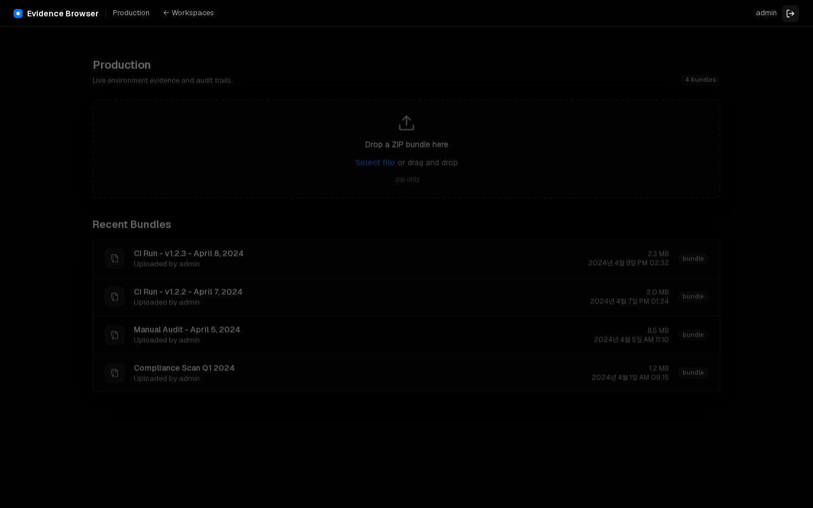

# Evidence Browser Demo Bundle

This sample bundle gives a fresh workspace something useful to render immediately.
It includes markdown, relative links, a table, an embedded screenshot, logs, and a
nested report directory.

## Quick Links

- [Application log](logs/app.log)
- [Nested report details](reports/2026/summary.md)
- [Raw metrics](data/metrics.json)

## Screenshot

## Run Summary

| Check | Status | Notes |
| --- | --- | --- |
| Bundle upload | Passed | ZIP accepted by the upload pipeline |
| Markdown render | Passed | Headings, links, and tables are visible |
| File tree | Passed | Nested report and log directories are browsable |

## Notes

The sample is intentionally small so it can be committed with the repository and
loaded quickly from a new instance.
