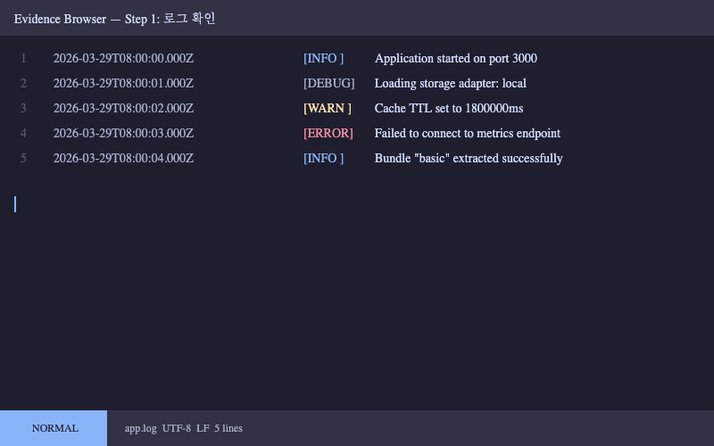

# Basic Test Evidence

## 요약
테스트가 성공적으로 완료되었습니다.

## 로그
- [앱 로그](logs/app.log)
- [에러 로그](logs/error.log)

## 스크린샷

## 스크립트
- [Setup](scripts/setup.sh)
- [Test](scripts/test.py)

## 결과
- [Output JSON](results/output.json)
- [상세 노트](notes.md)

## 외부 링크
- [GitHub PR](https://github.com/example/repo/pull/182)

## GFM 기능
| 항목 | 결과 |
|------|------|
| 테스트 A | 통과 |
| 테스트 B | 실패 |

- [x] Step 1 완료
- [ ] Step 2 보류
- ~~취소된 항목~~

> 인용문 테스트

`인라인 코드` 테스트
